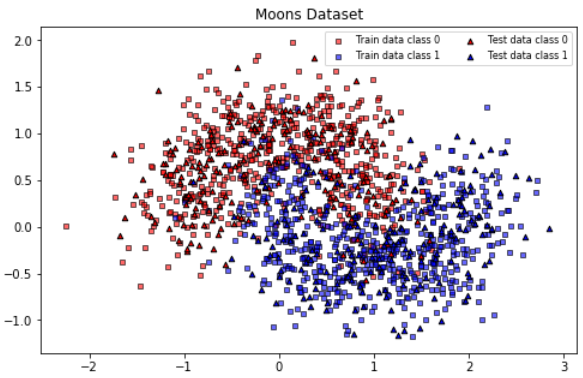
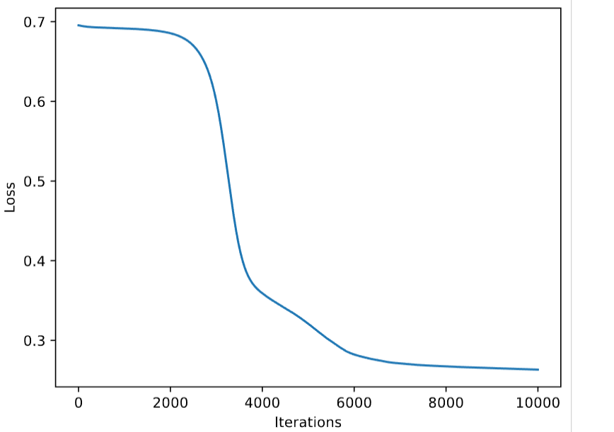
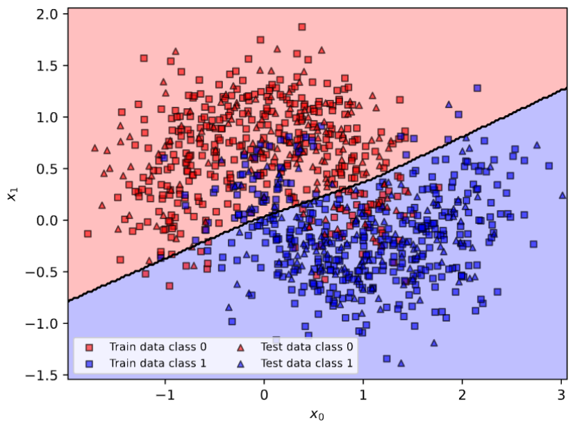
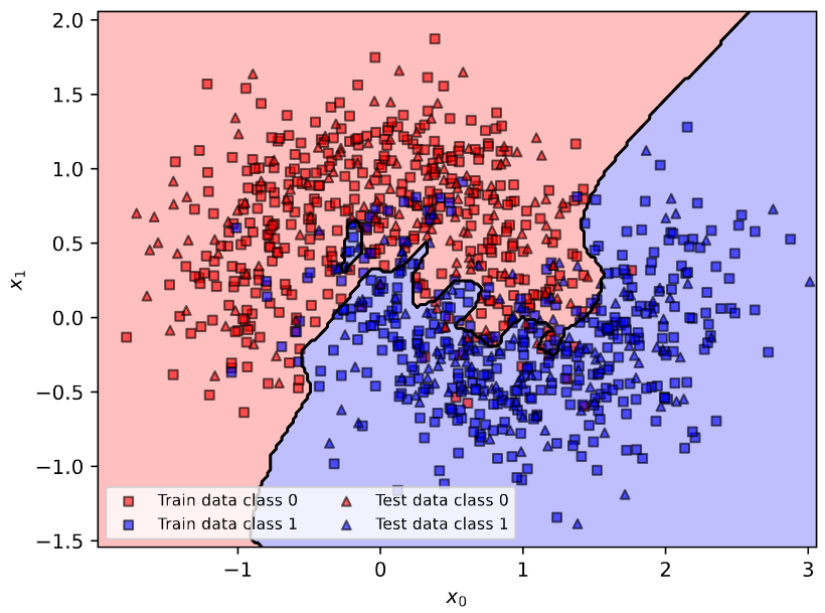
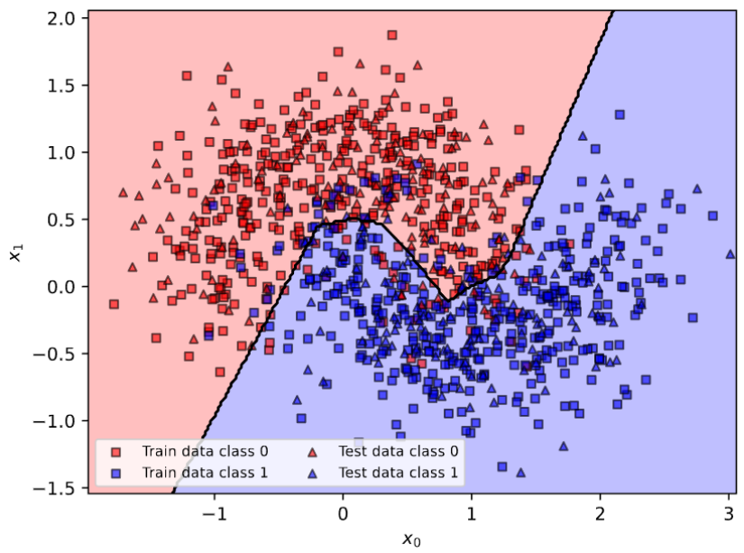

# Readme for Coding Assignment 02

## General Instructions

To obtain the code for this assignment, you will need to fetch and pull new commits from git@git.tu-berlin.de:lis-public/ai-course-student-ss25.git. Please refer to the instructions in [`00_README.md`](https://git.tu-berlin.de/lis-public/ai-course-student-ss25/-/blob/main/00/00_README.pdf?ref_type=heads).

As always, only modify the file `solution_??.py`. And even in `solution_??.py`, only modify what the functions do - don't change the function's names.

Run the following to install dependencies for this assignment. Remember to activate your virtual environment first.
```bash
# Activate virtual environment first
python3 -m pip install -r requirements_02.txt
```

Write your code only between `### BEGIN SOLUTION` and `### END SOLUTION` and remember to **replace** the line `raise NotImplementedError` with your code. Forgetting this may result in an exception and a grade of 0, even if your solution is correct:

```python
### BEGIN SOLUTION
#raise NotImplementedError << REMEMBER TO COMMENT OUT!

# Your code
a = b + c

### END SOLUTION
```

You can run tests by changing directory to the task folder `??`, and then simply typing `python3 -m pytest`. If you haven't yet, you will need to install pytest first. Please refer to the detailed setup-related instructions in [`00_README.md`](https://git.tu-berlin.de/lis-public/ai-course-student-ss25/-/blob/main/00/00_README.pdf?ref_type=heads).

## Implement a Neural Network for Binary Classification

In this coding assignment, you will implement and train a neural network to perform binary classification. You will use the `moons` dataset from [`sklearn.datasets`](https://scikit-learn.org/stable/datasets.html). This dataset is a collection of 2D points, each of which belongs to one of 2 possible classes. 




Most of the code is already implemented, but you have to complete some functions where code is missing. These functions can be identified by the question number and the following string in the docstring:

```python
##### This is an exercise #####
```

To understand the overall organization of the code, first check the `__main__` function and the function `train_evaluate(...)` that contains the logic for the overall training and evaluation pipeline. The code for `train_evaluate(...)`is already provided to you, but some of the functions that it depends on need to be completed by you. Read on for the details.


### 1. Network Initialization [1 Pt]

Complete the `__init__(...)` function of the `Network` class. This class represents a fully-connected neural network. The init function takes as input the dimension of the input (`input_size`), the number of units in each hidden layer (`hidden_size`), the number of hidden layers (`hidden_num`), and the dimension of the output (`output_size`) and creates the network layers. Code for creating the first hidden layer and the output layer is provided. Your task is to initialize the remaining hidden layers.

**Note**: A hidden layer is one whose output is not directly observed. Comments are provided in the code to help you.

### 2. Network Forward Function [1 Pt]
Complete the `forward(...)` function of the `Network` class. This function defines the forward pass of the neural network by passing the input x through all the layers and returns the prediction made by the network. Use ReLU activations in the hidden layers.

**Note**: The final layer does not use an activation function because it should output raw logits, which are used for tasks like classification where a subsequent softmax or other activation is applied in the loss function.

### 3. Network Predictions [1 Pt]
Implement the function `predict(...)` for producing network predictions. This function takes the network (`net`) and the input data (`x`), passes `x`through the network to compute the logits and finally predicts the binary classification labels. Check the detailed comments in the doctstring and the code.

### 4. Accuracy Calculation [1 Pt]
Implement the function `calc_accuracy(...)` which takes as input the labels predicted by the network (`Y_pred`) and the ground truth labels (`Y`) and returns the accuracy: i.e., the percentage of correct predictions (float between 0.0 and 1.0).

**Hint**: Try to do this without using a loop.

### 5. Function to Train the Network [1 Pt]
Implement the training function `train_network(...)` that takes a newly initialized network (`net`), the training inputs (`inputs`) and labels (`labels`), the optimizer (`optimizer`), the loss criterion (`criterion`), and the number of iterations (`iterations`), and trains the network. It returns the trained network and the list of losses observed during training. Detailed comments are provided in the code to guide your implementation.

### 6. (Optional, not graded) Training and Evaluation Pipeline
Once you have implemented all the functions correctly, you will be able to execute the full training and evaluation pipeline. For this, simply execute:

```bash
# First activate your venv and then run the script
python solution_02.py
```
In the terminal you will see that the shape of the training and test datasets are printed.

This is followed by a summary of your network (the layers, shapes, number of trainable parameters, and the model size). This comes from the function `torchsummary.summary(...)` that can be very useful to verify that your network is created correctly (more details can be found [here](https://pypi.org/project/torch-summary/)). 

Finally, you will see a progress bar showing you the training is underway. Once completed you will see the training and test accuracy.

You will also get a couple of plots (plotting functionality is provided to you):
 - The classification decision boundary (`decision_boundary.pdf`)
 - The losses observed during training (`loss.pdf`)

Example of a loss curve:




Try to play around with different hyperparameter values to see how the training and test accuracies change. For example, here we show examples of the decision boundary for three cases: underfitting, overfitting and just right:
<table>
    <thead>
        <tr>
            <th style="width: 33%; text-align: center;"><strong>Underfitting</strong></th>
            <th style="width: 33%; text-align: center;"><strong>Overfitting</strong></th>
            <th style="width: 33%; text-align: center;"><strong>Just Right</strong></th>
        </tr>
    </thead>
    <tbody>
        <tr>
            <td style="width: 33%;"></td>
            <td style="width: 33%;"></td>
            <td style="width: 33%;"></td>
        </tr>
    </tbody>
</table>


